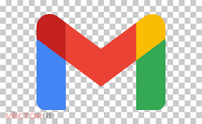

### Hi, I'm Kiran Upase !

Software Engineer | lifelong learner | Always curious about New Technologies and Programming World.

**Website :** [upasek.github.io](https://upasek.github.io/)

<!--

&ensp;&ensp;&ensp;&ensp;&ensp;&ensp;&ensp;

&ensp;&ensp;&ensp;&ensp;&ensp;&ensp;&ensp;

<!--

<!--
**upasek/upasek** is a ✨ _special_ ✨ repository because its `README.md` (this file) appears on your GitHub profile.

Here are some ideas to get you started:

- 🔭 I’m currently working on ...
- 🌱 I’m currently learning ...
- 👯 I’m looking to collaborate on ...
- 🤔 I’m looking for help with ...
- 💬 Ask me about ...
- 📫 How to reach me: ...
- 😄 Pronouns: ...
- ⚡ Fun fact: ...
-  [LeetCode](https://leetcode.com/KiranUpase/)
- 

  

-->
